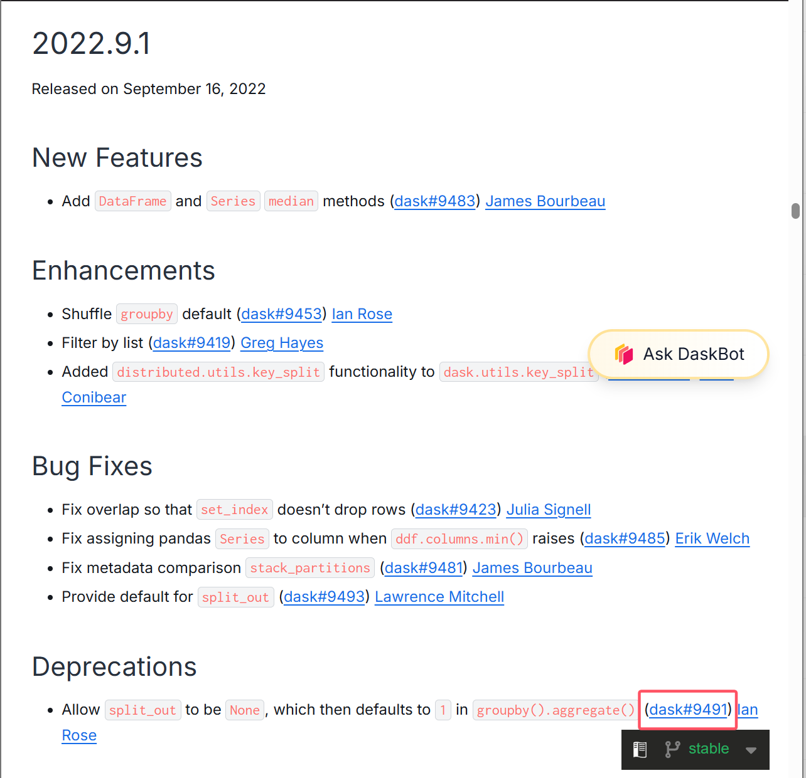
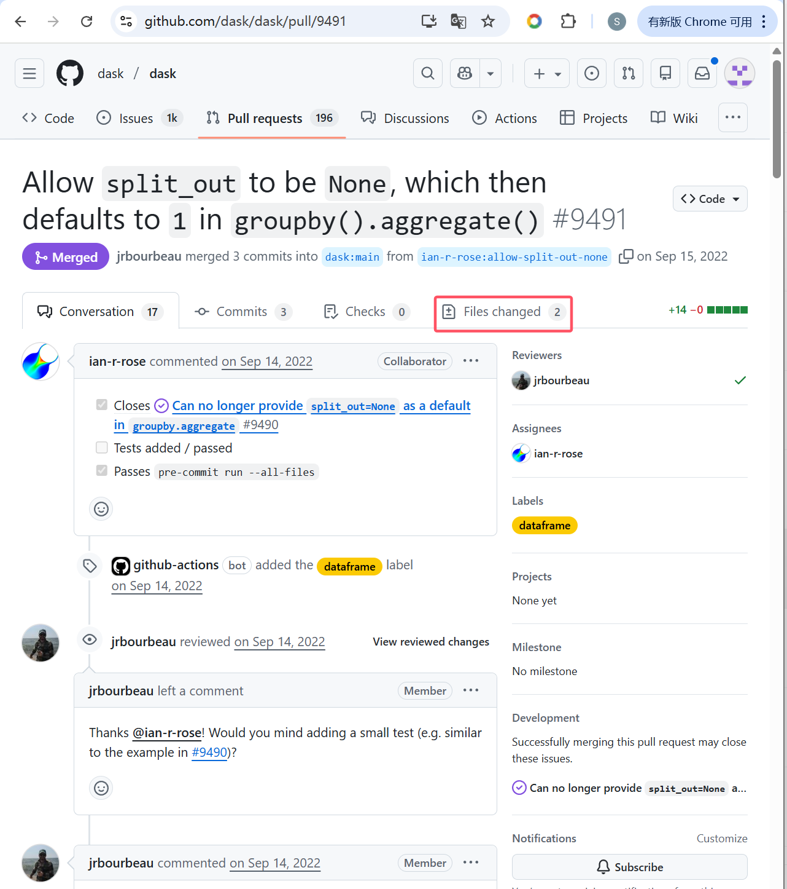
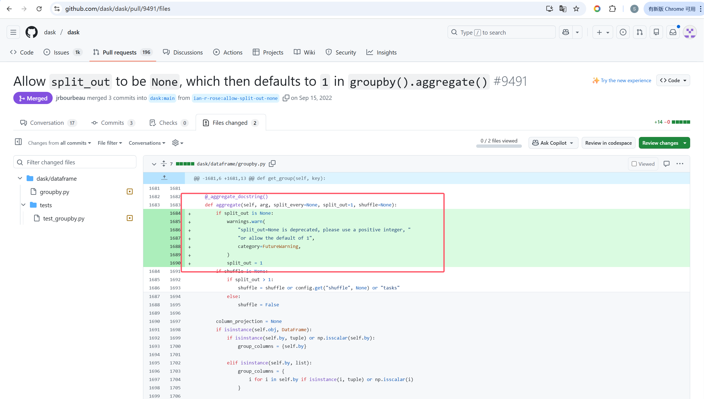
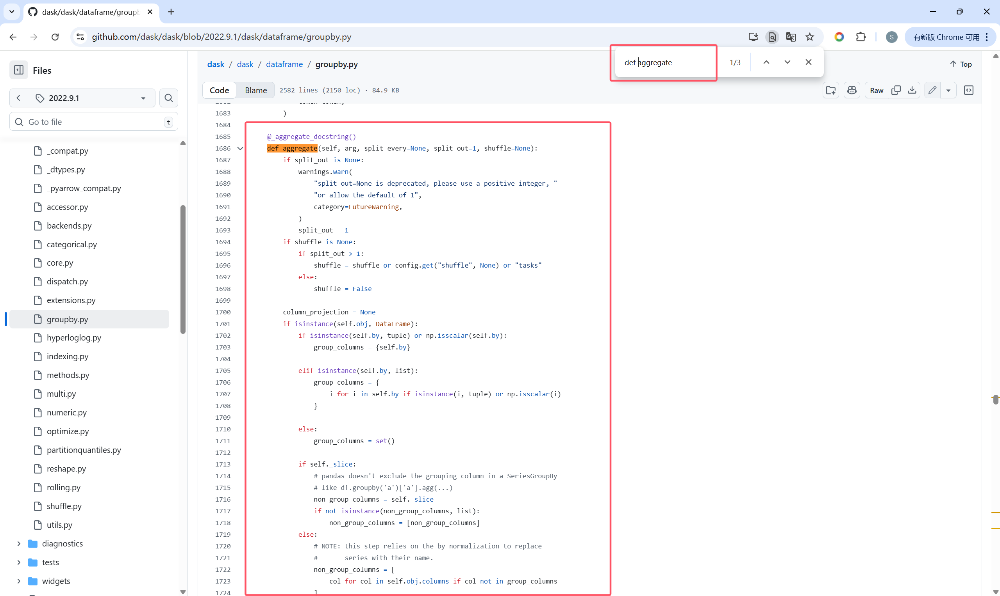
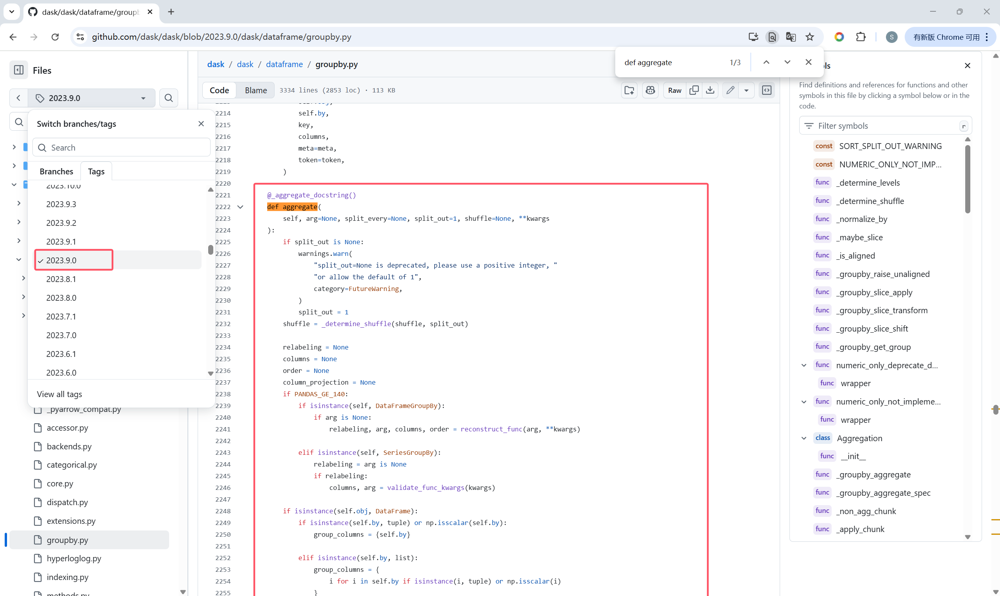
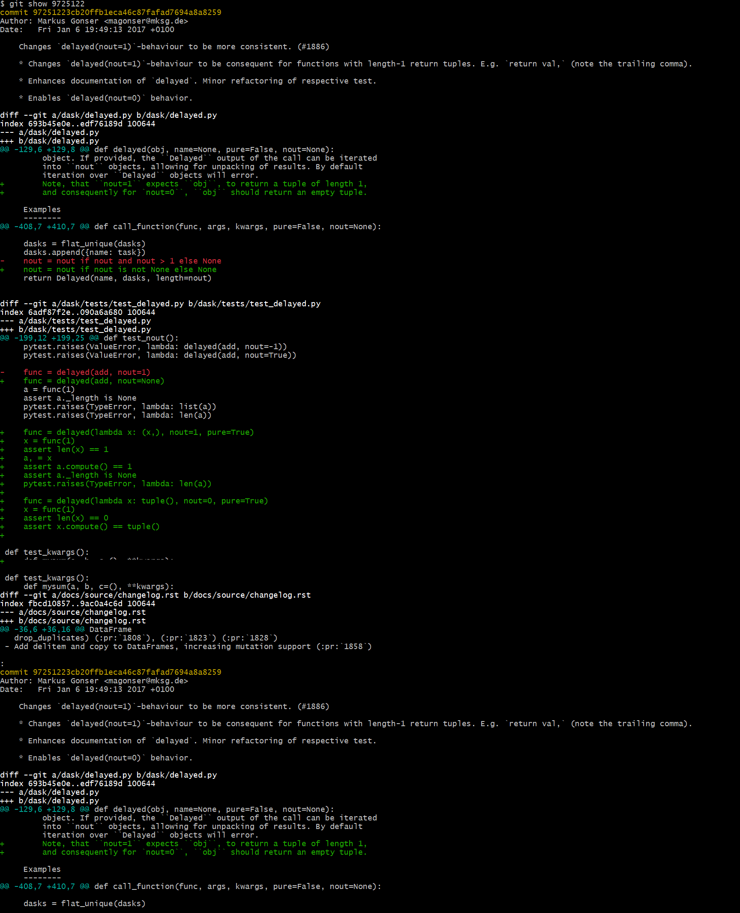

### 第三方库参数与返回值隐式类型变更收集流程

本研究旨在收集 Python 第三方库在版本迭代中发生的隐式类型变更（即在无类型注解或弱类型注解情况下，运行时数据类型的实际变更）。具体的数据收集与筛选流程如下：

#### 1. 变更日志初筛

- **关键字过滤**：查阅目标库的官方变更文档（Changelog），使用 `type`、~~return、default~~ 等关键字进行搜索定位。
- **语义分析**：阅读变更描述，初步判断该条目是否涉及参数类型（Parameter Type）~~或返回值类型（Return Value Type）~~的实质性变更。
  - *排除项*
    - 仅涉及代码重构、单纯增加类型注解、新增参数或删除参数的条目。
    - Bug Fixes 类目：若变更日志将某条目明确归类在 **Bug fixes** 或 **Fixed** 标题下，原则上直接跳过，不再进行后续追踪（聚焦于功能改进或 API 演进中的类型变化）。
    - 返回值变更排除：即便变更日志提到了返回值类型的变化，若不涉及参数接收范围的改动，则直接跳过。

#### 2. 源码定位与追踪

根据变更日志中的标签（Tag/Issue ID）定位具体的源码变更。此步骤分两种情况处理：

- **情况 A：标签直接链接到代码/PR**
  - 点击标签跳转至 GitHub 的 Pull Request 页面或 Commit 详情页，进入 Files changed 面板查看具体的代码差异。
  - 例
  - 
  - 点击对应标签后进入以下页面（此时注意该提交是Merged）
  - 
  - 这时点击Files changed查看代码变更并记住文件路径和函数名
  - 
  - 去github上的源码库中查找目标版本和上一个版本的函数体
  - 目标版本（对应表格的Target Version字段，需要在表格中记录完整函数体）
  - 
  - 
  - 
  - 当前版本（对应表格的Target Version字段，需要在表格中记录完整函数体）
  - 
  
  
  
- **情况 B：标签链接到 Issue 或无链接**
  
  - **跳转至 Issue 页**：若点击标签后跳转至 Issue 讨论页，后续操作又分以下情况
  
    - 标题关联区（首选）：查看 Issue 标题下方是否有紫色的合并图标及编号（如 <span style="color:purple">merged</span> #1687）。这是系统级关联，准确度最高，直接点击该编号跳转。
    - 例
    - 点击对应标签后进入Issue页面，并没有显示Commits和Files changed，而且显示Closed。但是同时显示了合并的标签`#1687`，点击`#1687`即可跳转（后续步骤如上所示）
  
    - 
    - 
  
    
  
    - 手动搜索（保底）：若页面内无任何有效 PR 链接，复制 Issue 的编号（如 2928）。前往仓库的 "Pull requests" 标签页，在搜索框输入 is:merged [Issue编号]（例如 is:merged 2928）。从搜索结果中寻找标题或描述中包含该编号且语义相符的 PR。
    - 例
    - 点击对应标签后进入Issue页面，并没有显示Commits和Files changed，而且显示Closed，也没有显示合并的标签，此时点击Pull reuqests
    - 
    - 在搜索框输入is:merged 2928，从搜索结果中查看到#2935是对#2928的修改并且是Merged，点击该行后续步骤如上所示
    - 
    - 
  
    
  
  - **手动检索：** 若变更日志中未提供直接链接，采用以下方法
  
    1. **本地 Git 仓库检索：** 将目标库源码 Clone 至本地，利用 Git 命令行工具进行精准定位
       - **基于描述检索**：提取变更日志中的独特关键词（如 Issue 编号或特定的报错信息），使用 `git log --grep="关键词" -i` 搜索提交记录。
       - **基于代码检索**：针对涉及具体参数名或变量名的变更（如 `nout=0`），使用 `git log -S "参数名"` 直接定位修改了该行代码的提交（Commit）。
    2. **GitHub 网页检索：** 若本地检索未果，则在 GitHub 仓库的 Pull Requests 栏目中，组合关键词（如 `is:merged "关键词"`）进行模糊搜索。
  
    **定位确认：** 检索获得 Commit ID 后，通过`git show + Commit ID`查看代码变更
  
  - 例
  
  - 
  
  - `git log --grep="nout=0" -i`找到ID
  
  - 
  
  - `git show + commit ID`查看代码变更
  
  - 
  
  - **若经过上述步骤仍无法找到确切对应的源码 Commit，则该条目视为“不可追踪”，不进行记录。**

#### 3. 变更有效性核验

在源码Diff页面进行深度核验，需同时满足以下条件才予以记录：

- **无类型注解**：发生变更的参数或返回值在源码中**没有类型注解**
- **纯类型变更判定**：
  - ~~**参数/返回值变更**：确认为参数接受类型范围的变化（如泛化 `str` -> `str | int` 或窄化 `float` -> `int`）或返回值类型的改变。~~
  - ~~**Default 关键字的特殊判定**：~~
    - ~~**不记录**：仅涉及默认值**数值/内容**的变更但类型未变（例如 `default=10` 变为 `default=20`，或 `default="a"` 变为 `default="b"`）。~~
    - ~~**记录**：默认值的变更导致了**类型属性**的变化（例如 `default=None` 变为 `default=""`），或者该默认值的改变直接导致函数在未传参时的**返回值类型**发生改变。~~
  - **参数类型变更**：**仅当函数/方法对参数的“实际可接收类型范围”发生实质性改变时才予以记录（如从接受 `int` 变为接受 `int | str`，或停止支持某种类型）。** 若变更仅涉及内部处理逻辑的优化，而未改变该参数的准入门槛，则不予考虑。大致为以下两种情况：
    - 1、代码变更前可接收某种类型且正常运行，但变更后针对该类型会主动抛出错误（如 `TypeError` 或 `ValueError`。`Warning`的情况也可记录，但需标记出来），限制了输入范围。
    - 2、变更前后参数可接收的类型集合发生了实质性的不一致（例如从只收 `str` 变为可同时接收 `str | bytes`，或者将原本接收的 `list` 改为仅接收 `ndarray`）。
  - ~~**返回值类型变更**：确认为返回值物理类型的改变（如 `list` -> `tuple`）。~~
- **排除项**：
  - ~~**私有方法排除**：不记录以 `_` 开头的私有函数/方法（Private Methods）的变更，除非该变更是通过公共 API 暴露的（见步骤 4 处理）。~~
  - 剔除仅涉及逻辑增强但未改变数据类型的变更。
  - 剔除关键字参数转位置参数、新增/删除 API 等非类型变更情况。
  - 剔除源码层面属于**“隐式 Bug 修复”**的~~返回值~~变更。
  - **剔除那些为了使程序行为符合原始设计意图而进行的修复。** 例如：
    - 修正因逻辑漏洞导致的**类型降级**（如：原本设计应返回 `DataFrame` 但由于 Bug 意外返回了 `Series`，后续修复回 `DataFrame` 的变更）。
    - 修复违反开发者原始设计直觉的异常返回行为。
  - 返回值变更排除：完全不考虑任何仅涉及返回值变化的条目。

#### 4. 数据录入与文档化

将符合条件的变更信息录入数据集表格，包含以下字段：

- **API**：
  - **常规情况**：填写发生变更的具体公共函数或方法的全限定名
  - **内部辅助函数情况**：~~若源码变更发生在内部辅助函数（Utility/Helper，通常无直接文档对应的私有或底层函数），且变更日志未明确提及该辅助函数名，**需记录调用该辅助函数的外部公共 API**。~~若源码变更发生在内部辅助函数（Utility/Helper）或底层实现类中，且该函数非公开接口，**需向上追溯调用链，直到找到用户直接调用的最顶层公共 API（Top-level Public API），并记录该 API 名称**。若涉及多个公共 API 调用该底层函数，需分别记录。
  - **记录格式**：`Public_API_Name(Internal_Helper_Name -> Internal Helper/Utility)`。
    - 示例：`dask.array.wrap.ones(dask.array.wrap.wrap_func_shape_as_first_arg)`。
  
- **Current Version / Target Version**：分别记录变更发生前的版本号和发生变更的版本号。

- **Current Definition / Target Definition**：
  
  - 分别摘录变更前后的完整函数/方法签名及关键逻辑代码。
  - **高亮标记**：在表格中手动将发生变更的关键代码片段用**红色字体**标出，以便直观对比。
  - 若变更发生在内部辅助函数或底层实现类中，需采用 **“公共接口摘要 + 内部实现详述”** 的组合方式记录：
  
    - **公共接口层（Public API）**：仅摘录公共 API 的**函数签名**以及**直接/间接调用该内部方法的关键语句**（**不需要**记录公共 API 的完整函数体，用 `...` 省略无关代码）。
  
    - **内部实现层（Internal Implementation）**：记录实际发生逻辑变更的内部函数/方法的**完整代码**。
  
    - 示例
  
    - Current Definition(变更处需红色高亮标出，但是这里展示不了)：
  
    - ```
      pandas/io/sas/sasreader.py
      
      def read_sas(
          filepath_or_buffer: FilePath | ReadBuffer[bytes],
          *,
          format: str | None = None,
          index: Hashable | None = None,
          encoding: str | None = None,
          chunksize: int | None = None,
          iterator: bool = False,
          compression: CompressionOptions = "infer",
      ) -> DataFrame | ReaderBase:
      ...
              from pandas.io.sas.sas7bdat import SAS7BDATReader
      
              reader = SAS7BDATReader(
                  filepath_or_buffer,
                  index=index,
                  encoding=encoding,
                  chunksize=chunksize,
                  compression=compression,
              )
      ...
      
      pandas/io/sas/sas7bdat.py
      
      def _convert_datetimes(sas_datetimes: pd.Series, unit: str) -> pd.Series:
          """
          Convert to Timestamp if possible, otherwise to datetime.datetime.
          SAS float64 lacks precision for more than ms resolution so the fit
          to datetime.datetime is ok.
      
          Parameters
          ----------
          sas_datetimes : {Series, Sequence[float]}
             Dates or datetimes in SAS
          unit : {str}
             "d" if the floats represent dates, "s" for datetimes
      
          Returns
          -------
          Series
             Series of datetime64 dtype or datetime.datetime.
          """
          try:
              return pd.to_datetime(sas_datetimes, unit=unit, origin="1960-01-01")
          except OutOfBoundsDatetime:
              s_series = sas_datetimes.apply(_parse_datetime, unit=unit)
              s_series = cast(pd.Series, s_series)
              return s_series
      ```
  
    - Target Definition(变更处需红色高亮标出，但是这里展示不了):
  
    - ```
      pandas/io/sas/sasreader.py
      
      def read_sas(
          filepath_or_buffer: FilePath | ReadBuffer[bytes],
          *,
          format: str | None = None,
          index: Hashable | None = None,
          encoding: str | None = None,
          chunksize: int | None = None,
          iterator: bool = False,
          compression: CompressionOptions = "infer",
      ) -> DataFrame | ReaderBase:
      ...
              from pandas.io.sas.sas7bdat import SAS7BDATReader
      
              reader = SAS7BDATReader(
                  filepath_or_buffer,
                  index=index,
                  encoding=encoding,
                  chunksize=chunksize,
                  compression=compression,
              )
      ...
      
      pandas/io/sas/sas7bdat.py
      
      def _convert_datetimes(sas_datetimes: pd.Series, unit: str) -> pd.Series:
          """
          Convert to Timestamp if possible, otherwise to datetime.datetime.
          SAS float64 lacks precision for more than ms resolution so the fit
          to datetime.datetime is ok.
      
          Parameters
          ----------
          sas_datetimes : {Series, Sequence[float]}
             Dates or datetimes in SAS
          unit : {'d', 's'}
             "d" if the floats represent dates, "s" for datetimes
      
          Returns
          -------
          Series
             Series of datetime64 dtype or datetime.datetime.
          """
          td = (_sas_origin - _unix_origin).as_unit("s")
          if unit == "s":
              millis = cast_from_unit_vectorized(
                  sas_datetimes._values, unit="s", out_unit="ms"
              )
              dt64ms = millis.view("M8[ms]") + td
              return pd.Series(dt64ms, index=sas_datetimes.index, copy=False)
          else:
              vals = np.array(sas_datetimes, dtype="M8[D]") + td
              return pd.Series(vals, dtype="M8[s]", index=sas_datetimes.index, copy=False)
      ```
  
    - 
  
- **Evolution Type**：分类标记为 `parameter type change`（参数类型变更）~~或 `return type change`（返回值类型变更）~~，并详细解释变更前后的行为差异。初步分为以下三类
  
  - 1、`parameter type change (widening)`：参数接受了以前不支持的类型。
  
    2、`parameter type change (narrowing)`：停止支持某种类型，或由“接受”转为“报错”。
  
  - 辅助生成：可将提取的代码片段输入大模型（LLM），提示其分析具体的类型演化逻辑。
  
  - ```提示词
    # 第一版（弃用）
    # Role: API Evolution Analyst
    You are an expert in analyzing Python library code changes. Your task is to classify the type of API change and describe the semantic shift in the type contract.
    
    # Input
    A code diff (image or text) showing a change in a Python function.
    
    # Task
    Determine if there is a **Parameter Type Change**, **Return Type Change**, or **Implicit Type Validation Change**. If yes, generate an output strictly following the format below.
    
    # Allowed Categories (Labels)
    1. **return type change** (e.g., list -> tuple, scalar -> iterable)
    2. **parameter type change (widening)** (e.g., int -> int|None, accepting new types)
    3. **parameter type change (narrowing)** (e.g., stopping support for None or specific types)
    4. **implicit type validation relaxation** (e.g., logic change allowing previously rejected types like 'uint')
    
    # Output Format Rule
    Provide the output in exactly three blocks separated by empty lines. Do not add markdown bolding (**...**) to the content text, only to the headers if preferred.
    
    [Category Label]
    
    Before change: [Describe the old type state. Focus on what was accepted/returned and any limitations or errors that existed for specific types.]
    
    After change: [Describe the new type state. Focus on the new allowed types, structure changes, or behavior improvements regarding types.]
    
    # Example Output
    parameter type change (narrowing)
    
    Before change: Implicitly accepted value as float (specifically np.nan) for integer arrays (potentially causing silent errors).
    
    After change: Restricts value type for integer arrays; explicitly raises ValueError if np.nan is provided.
    ```
  
  - 
  
  - **大模型配置要求**：
  
    - 使用 ChatGPT 模型，选择 Thinking 5.4 版本，并开启进阶思考模式。
    - 
    - 
    - 
    - 
  
  - 提示词：
  
  - ```
    # Role: API Parameter Evolution Analyst
    You are an expert in analyzing Python library code changes. Your task is to identify and classify intentional shifts in an API's **parameter type contract**.
    
    # Input
    A code diff (image or text) showing a change in a Python function, along with its Changelog description.
    
    # Task
    Determine if there is a **Parameter Type Change**. 
    **CRITICAL RULES:**
    1. **IGNORE ALL RETURN VALUE CHANGES.** If the change only affects the output type or structure, discard it.
    2. **IGNORE FUNCTIONAL BUG FIXES.** If a type previously failed/errored due to a bug and now works correctly, this is a "fix," not an "evolution." Discard it.
    3. **FOCUS ON THRESHOLDS.** Only record if the set of "acceptable input types" has been intentionally expanded, restricted, or redefined.
    
    # Allowed Categories (Labels)
    1. **parameter type change (widening)**: The API now accepts types that were previously unsupported or caused errors.
    2. **parameter type change (narrowing)**: The API stopped supporting a previously valid type, or now explicitly raises an error (e.g., TypeError/ValueError) for a type that used to be processed.
    
    # Output Format Rule
    Provide the output in exactly three blocks separated by empty lines. No markdown bolding in the content.
    
    [Category Label]
    
    Before change: [Describe the original parameter acceptance state. Mention what types were accepted and any implicit conversion or loose validation.]
    
    After change: [Describe the new parameter acceptance state. Focus on the new restrictions, new allowed types, or formalized validation logic.]
    ```
  
  - 
  
  - 
  
- **Key Words**：记录初筛时命中的搜索关键字（~~如~~ `type`~~,`default`, `return` 等~~）。

- **Changelog Reference ID**：

  - **描述**：记录官方 Changelog 条目末尾引用的 Issue 或 PR 编号
  - **获取方式**：直接复制 Changelog 条目中括号内的编号（例如图示中的 `61916`）
  - 
  - **作用**：作为变更的原始入口索引

- **Implementation Pull Request ID(Files Changed)**

  - **描述**：记录实际包含该变更代码差异（Files changed）的 Pull Request 编号。

  - **获取方式**：

    1. 点击 Changelog Reference ID 的链接进入 GitHub 页面

    2. 如果进入的是一个 Issue 页面（通常左上角显示绿色的 Open 或紫色的 Closed Issue 图标），请查看右侧边栏的 **"Development"** 或 **"Linked pull requests"** 区域

    3. 找到状态为 **Merged**（紫色图标）的号码（例如图示中的 `#62718`），该号码即为 Implementation Pull Request ID

       

    4. 注意：如果 Changelog 直接链接到的就是 PR 页面，则此字段与 Changelog Reference ID 相同


任务分工：

老师：numpy、tensorflow、django、scipy、transformers、polars、sympy、networkx、plotly、keras、xgboost、flask、PIL、rich、httpx


黄元榕：pandas、torch、matplotlib、sklearn、pydantic、fastapi、spacy、gensim、jax、lightgbm、tornado、redis、requests、faker、loguru